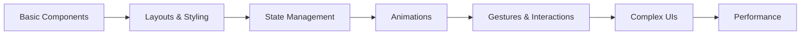

# 🎨 Compose UI Playground

[](https://kotlinlang.org)
[](https://developer.android.com/jetpack/compose)
[](LICENSE)
[](CONTRIBUTING.md)

> A hands-on Jetpack Compose learning repository where each branch contains a unique UI implementation. Practice, explore, and master Compose through practical examples - one branch at a time.

## 📖 About This Project

This repository is designed to help Android developers learn Jetpack Compose through **practical, real-world UI implementations**. Each branch focuses on a specific UI pattern, component, or concept, making it easy to:

- 🎯 Focus on one concept at a time
- 📱 See working implementations
- 🔄 Compare different approaches
- 💡 Learn best practices
- 🚀 Build production-ready UIs

## 🌟 Why Branch-Based Learning?

Traditional tutorials often mix multiple concepts, making it hard to focus. This repository uses a **branch-per-concept** approach:

- **Isolated Learning**: Each branch contains one complete UI example
- **No Clutter**: Focus on what matters without distractions
- **Easy Navigation**: Switch branches to explore different UIs
- **Version Control**: Track your progress and experiments
- **Reusable Code**: Copy and adapt what you need

## 🚀 Getting Started

### Prerequisites

- Android Studio Hedgehog (2023.1.1) or later
- JDK 17 or higher
- Basic knowledge of Kotlin
- Familiarity with Android development

### Installation

1. **Clone the repository**
   ```bash
   git clone https://github.com/yourusername/compose-ui-playground.git
   cd compose-ui-playground
   ```

2. **View available branches**
   ```bash
   git branch -a
   ```

3. **Switch to a specific UI branch**
   ```bash
   git checkout branch-name
   ```

4. **Open in Android Studio**
   - Open Android Studio
   - Select "Open an Existing Project"
   - Navigate to the cloned directory
   - Wait for Gradle sync to complete

5. **Run the app**
   - Connect your device or start an emulator
   - Click the "Run" button or press `Shift + F10`

## 📂 Repository Structure

```
compose-ui-playground/
├── main (default branch)
│   ├── README.md
│   └── BRANCH_INDEX.md (List of all UI branches)
│
├── ui/login-screen
├── ui/profile-card
├── ui/animated-button
├── ui/custom-dialog
└── ... (more UI branches)
```

## 🎯 Available UI Branches

Each branch is prefixed with `ui/` for easy identification. Here's a sample of what you'll find:

| Branch Name | Difficulty | Description |
|------------|-----------|-------------|
| `ui/login-screen` | Beginner | Clean login UI with validation |
| `ui/profile-card` | Beginner | Material Design profile card |
| `ui/bottom-navigation` | Beginner | Bottom nav with multiple tabs |
| `ui/animated-button` | Intermediate | Custom animated button effects |
| `ui/swipe-to-delete` | Intermediate | Swipeable list items |
| `ui/custom-dialog` | Intermediate | Beautiful custom dialogs |
| `ui/collapsing-toolbar` | Advanced | Collapsing toolbar animation |
| `ui/parallax-scroll` | Advanced | Parallax scrolling effect |

> 📝 See [BRANCH_INDEX.md](BRANCH_INDEX.md) for the complete list with screenshots and learning objectives.

## 📚 How to Use This Repository

### For Beginners

1. Start with branches marked as **Beginner**
2. Read the branch's README for learning objectives
3. Run the app and interact with the UI
4. Study the code comments and structure
5. Try modifying colors, sizes, and text
6. Experiment and break things (that's learning!)

### For Intermediate Learners

1. Pick a branch that interests you
2. Understand the overall architecture
3. Study state management patterns
4. Learn animation and gesture handling
5. Try implementing variations
6. Combine concepts from multiple branches

### For Advanced Developers

1. Use as a reference for complex UIs
2. Study performance optimization techniques
3. Learn advanced animation patterns
4. Contribute your own UI implementations
5. Help review and improve existing branches

## 🎓 Learning Path



**Recommended Order:**
1. Basic UI components (Text, Button, Image)
2. Layout fundamentals (Column, Row, Box)
3. State and recomposition
4. Navigation patterns
5. Animations and transitions
6. Custom components
7. Advanced patterns and optimization

## 🤝 Contributing

We welcome contributions! Here's how you can help:

### Adding a New UI Branch

1. **Fork the repository**
2. **Create a new branch** from `main`
   ```bash
   git checkout main
   git pull origin main
   git checkout -b ui/your-ui-name
   ```
3. **Implement your UI** with:
   - Clean, readable code
   - Comments explaining key concepts
   - A dedicated README in the branch
   - Screenshots or GIFs
4. **Submit a Pull Request** with:
   - Clear description of the UI
   - Learning objectives
   - Difficulty level
   - Screenshots

### Contribution Guidelines

- ✅ One UI concept per branch
- ✅ Follow Material Design principles
- ✅ Include comprehensive comments
- ✅ Add a README with screenshots
- ✅ Test on multiple screen sizes
- ✅ Use meaningful variable names
- ✅ Follow Kotlin coding conventions

## 📸 Screenshots

> Each branch contains its own screenshots showing the implemented UI

| Login Screen | Profile Card | Animated Button |
|-------------|--------------|-----------------|
|  |  |  |

## 🛠️ Tech Stack

- **Language**: Kotlin
- **UI Framework**: Jetpack Compose
- **Architecture**: MVVM (where applicable)
- **State Management**: Compose State, ViewModel
- **Navigation**: Compose Navigation
- **Design System**: Material Design 3
- **Build System**: Gradle with Kotlin DSL

## 📖 Resources

### Official Documentation
- [Jetpack Compose Docs](https://developer.android.com/jetpack/compose)
- [Compose Pathway](https://developer.android.com/courses/pathways/compose)
- [Material Design 3](https://m3.material.io/)

### Community Resources
- [Compose Academy](https://compose.academy/)
- [Android Developers YouTube](https://www.youtube.com/c/AndroidDevelopers)
- [r/androiddev](https://www.reddit.com/r/androiddev/)

## 💬 Community & Support

- **Issues**: Found a bug? [Open an issue](https://github.com/Thogaruchesti-hemanth/compose-ui-playground/issues)
- **Discussions**: Questions? [Start a discussion](https://github.com/Thogaruchesti-hemanth/compose-ui-playground/discussions)
- **Instagram**: Follow [@Thogaruchesti-hemanth](https://www.instagram.com/indian_mobile_developer) for updates

## 📜 License

This project is licensed under the MIT License - see the [LICENSE](LICENSE) file for details.

## ⭐ Show Your Support

If this repository helped you learn Compose, please:
- ⭐ Star this repository
- 🐦 Share it on social media
- 🤝 Contribute your own UI implementations
- 📝 Write about your learning experience

## 🙏 Acknowledgments

- Thanks to all contributors who help make this resource better
- Inspired by the amazing Android developer community
- Built with ❤️ for learners worldwide

---

<div align="center">

**Happy Composing! 🚀**

Made with ❤️ by [Thogaruchesti Hemanth](https://github.com/Thogaruchesti-hemanth)

[⬆ Back to Top](#-compose-ui-playground)

</div>
